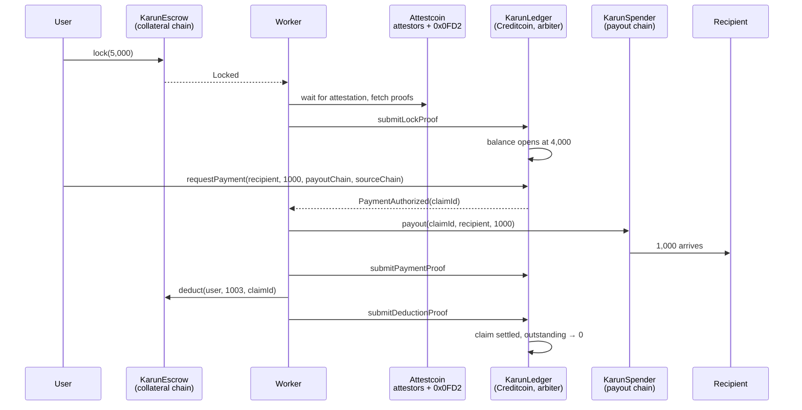

# Karun — One Spendable Balance Across Every Chain

**BUIDL CTC 2026 Fall submission — powered by the Attestcoin Protocol on Creditcoin.**

> Named after King Croesus ("Karun" in Turkish), the Anatolian king who minted the world's first coins. His wealth was proverbial because it was recognised everywhere.

**[Live demo](https://karun-eta.vercel.app)** · **[Documentation](docs/)** · **[Testnet run](TESTNET.md)**

Verified end to end on testnet: one payment cycle, three separate Attestcoin proofs checked on chain. Locked 5,000 mUSDC, opened a 4,000 balance, paid a recipient 1,000 from the Karun pool, deducted 1,003 from the escrow, closed the claim. Outstanding debt afterwards: zero.

## The problem

Capital is scattered. A user holds stablecoins on one chain and needs to pay on another. Today the only answer is bridging: lock or burn on one side, wait, mint a wrapped asset on the other, trust whatever sits in the middle. The user never wanted to move their money. They wanted to make a payment.

## The idea

Karun separates **where value sits** from **where value is spent**.

1. **Lock** stablecoins into a `KarunEscrow` on a chain where you already hold them. No wrapped token is minted for you.
2. The lock is **proven on Creditcoin** through Attestcoin readability, verified by the Block Prover Precompile at `0x0FD2`. `KarunLedger` opens a single spendable balance worth **80% of the attested collateral**.
3. **Pay on the chain you choose.** The recipient is paid from the `KarunSpender` pool on that chain, in real tokens. They sign nothing and need no gas anywhere else.
4. The amount plus a **0.30% fee is deducted from your escrow**, and that deduction is **proven back on Creditcoin**, settling the claim.

No debt accrues. Every payment settles against your own funds, wherever they sit. The 80% buffer covers the settlement window.

## Creditcoin is the arbiter, not a payment rail

This is the design decision the whole project rests on. Creditcoin holds **no user funds and makes no payouts**. It verifies proofs, keeps the single balance, prevents double spends and settles claims. Money always moves on the chain the user picked.

The alternative, paying from Creditcoin, would force every user to end up with a balance there. That is bridging with extra words.

## Why Attestcoin is load bearing

Every completed payment produces **three** on chain verifications on Creditcoin:

| Proof | Source event | What it establishes | Without it |
|---|---|---|---|
| Lock | `Locked` | The collateral really exists | The worker could invent balances |
| Payout | `Paid` | The recipient really got paid | The protocol could deduct without paying |
| Deduction | `Deducted` | The escrow really took the money | Claims would close on a courier's word |

Remove the protocol and there is no honest way to run any of these steps.

The precompile proves inclusion only, so the contract does the rest itself: it requires `receiptStatus == 1`, accepts events only from the registered contract for that chain, and stores a query id per proof so nothing can be replayed.

## Architecture



### Contracts

| Contract | Chain | Role |
|---|---|---|
| `KarunLedger.sol` | Creditcoin | The arbiter. Attestcoin Smart Contract: verifies all three proofs, holds the balance, authorises payments, settles claims. Holds no tokens. |
| `KarunEscrow.sol` | Collateral chain | Collateral vault: lock, settled deduction, delayed withdrawal |
| `KarunSpender.sol` | Payout chain | Liquidity pool and payout endpoint, one payout per claim id |
| `KarunAscBase.sol` | Creditcoin | Reusable ASC base: precompile handle, query ids, replay protection |
| `MockUSDC.sol` | both | 6 decimal demo stablecoin |

### Security properties

- **Replay protection:** every proof maps to a unique query id derived from chain key, block height and transaction index.
- **Receipt status check:** the precompile proves inclusion, not success; the ledger requires `receiptStatus == 1` itself.
- **Emitter check:** only events from the address registered for that chain count.
- **Monotonic collateral:** `Locked` carries cumulative totals and the ledger only raises collateral from a lock proof, so stale proofs are inert.
- **Per chain solvency:** a payment must be coverable by the collateral on the chain it will settle from.
- **Double spend safety:** all accounting lives in one contract, and the amount is reserved before the payout is authorised.
- **Bounded operator:** the operator key can only carry actions the ledger already authorised. It cannot create collateral, raise a balance or settle a claim.

Full analysis, including what happens when the worker dies mid cycle: [security model](docs/security-model.md).

### Roadmap: removing the last trusted party

Attestcoin **Writability** is under audit at the time of writing. Until it ships, an operator key carries the two outbound actions. When it lands, the ledger publishes those instructions through an Outbox and an Inbox executes them on the destination chain, validated by attestor signatures. The operator leaves the trust model; claim ids and replay protection stay exactly as they are.

## Repo layout

```
src/      contracts: Ledger (arbiter), Escrow, Spender, AscBase, MockUSDC
test/     21 forge tests, including a full cross chain cycle
sim/      three chain local simulation, 8 scenarios, 20 assertions
script/   deployment scripts
worker/   offchain worker: proofs via @gluwa/usc-sdk, resumable, serial queue
arayuz/   the interface, reads contracts directly with no backend
docs/     full documentation
```

## Run

```bash
forge test          # 21 unit tests
sim/calistir.sh     # three local chains, full cycle plus failure paths
npm run worker      # the offchain worker
```

Deployment steps and network details: [running locally](docs/running-locally.md) · Live addresses: [deployments](docs/deployments.md).

## Team

Ömer Metehan İzal — [@Foreveranka](https://github.com/Foreveranka) · İstanbul, Türkiye · focus: DeFi, payments, stablecoins
