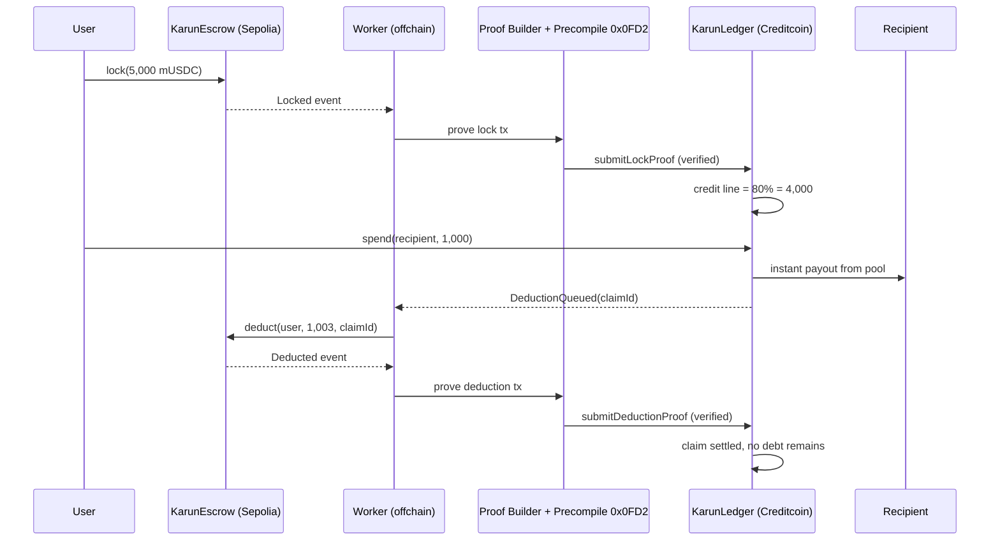

# Karun — One Spendable Balance Across Every Chain

**BUIDL CTC 2026 Fall submission — powered by the Attestcoin Protocol on Creditcoin.**

> Named after King Croesus ("Karun" in Turkish), the Anatolian king who minted the world's first coins.

**[Live demo](https://karun-eta.vercel.app)** · **[Documentation](docs/)** · **[Testnet deployment and recorded run](TESTNET.md)**

Live on testnet: a single payment cycle verified three separate Attestcoin proofs on chain. Locked 5,000 mUSDC on Sepolia, paid a recipient 1,000 on Sepolia from the Karun pool, and settled it from the escrow. Outstanding debt after the cycle: zero.

## The Problem

Your money is scattered across chains. Spending on a chain where you hold nothing means bridging: slow, costly, and risky. Every bridge hop is friction and attack surface.

## The Idea

Karun turns funds on *any* chain into **one spendable balance**, with **no bridging**:

1. **Lock** stablecoins into a `KarunEscrow` on each source chain (e.g. Sepolia).
2. The lock is **cryptographically proven on Creditcoin** via Attestcoin Protocol readability (Block Prover Precompile `0x0FD2`). `KarunLedger` opens a unified credit line worth **80% LTV** of your attested collateral.
3. **Spend anywhere Karun has liquidity**: the recipient is paid *instantly* from the protocol's local pool.
4. The exact amount (+ a 0.30% fee) is **auto-deducted from your escrow** on the source chain. The deduction itself is then **proven back on Creditcoin** via Attestcoin readability, settling the claim.

No debt accrues. Every spend settles against your own funds, wherever they sit. The 80% buffer covers in-flight latency and volatility.

## Why Attestcoin Is the Core

Attestcoin readability is used **twice per spend cycle**, and the system cannot function without it:

- **Lock proof** — the credit line only opens after `verifyAndEmit()` on the Block Prover Precompile confirms the `Locked` event happened on the source chain. No trusted oracle.
- **Deduction proof** — the ledger only releases a claim after the `Deducted` event is verified the same way. The protocol cannot lie about having settled.

## Architecture



### Contracts

| Contract | Chain | Role |
|---|---|---|
| `KarunEscrow.sol` | Source chain (Sepolia) | Collateral vault: lock, operator deduction, delayed withdrawal |
| `KarunLedger.sol` | Creditcoin testnet | Attestcoin Smart Contract: verifies lock/deduction proofs, manages the unified credit line, pays spends from the pool |
| `KarunAscBase.sol` | Creditcoin testnet | Reusable ASC base: precompile integration + replay protection |
| `MockUSDC.sol` | both | 6-decimal demo stablecoin |

### Security properties

- **Replay protection**: every proof maps to a unique query id, processed once.
- **Receipt status check**: precompile proves inclusion only; the ledger additionally requires `receiptStatus == 1`.
- **Emitter check**: only events emitted by the registered escrow address count.
- **Monotonic collateral sync**: `Locked` events carry cumulative totals, so stale proofs can never inflate a balance.
- **Per-chain solvency**: a spend must be coverable by the collateral on the chain it will be deducted from.
- **Double-spend safety**: all limit accounting lives in one place (Creditcoin ledger).

### Roadmap: from operator to full trustlessness

Attestcoin **Writability** is not yet live on testnet (per official docs, it is under audit). Today the escrow deduction is triggered by an operator key, but the *settlement of the claim is already trustless* (proven via readability). When Writability ships, the operator is replaced by an Outbox→Inbox message from the ledger itself, closing the loop with zero trusted parties. LP liquidity provisioning and multi-chain rebalancing follow the same path.

## Repo layout

```
src/            contracts (Escrow, Ledger, AscBase, MockUSDC)
test/           15 forge tests incl. full lock→prove→spend→deduct→settle cycle
script/         forge deploy scripts (Sepolia + Creditcoin testnet)
worker/         offchain worker: proof generation via @gluwa/usc-sdk + prover API
```

## Run

```bash
# tests
forge test

# deploy (fill .env first, see .env.example)
forge script script/Deploy.s.sol:DeploySepolia    --rpc-url sepolia            --broadcast
ESCROW_ADDRESS=0x... \
forge script script/Deploy.s.sol:DeployCreditcoin --rpc-url creditcoin_testnet --broadcast

# worker
npm install && npm run worker
```

Network reference: Creditcoin testnet RPC `https://rpc.cc3-testnet.creditcoin.network` (chain id 102031), proof builder `https://prover.cc3-testnet.creditcoin.network`, source chain Sepolia (chain key 1).

## Team

Ömer Metehan İzal — [@Foreveranka](https://github.com/Foreveranka) · İstanbul, Türkiye · focus: DeFi / payments / stablecoins
