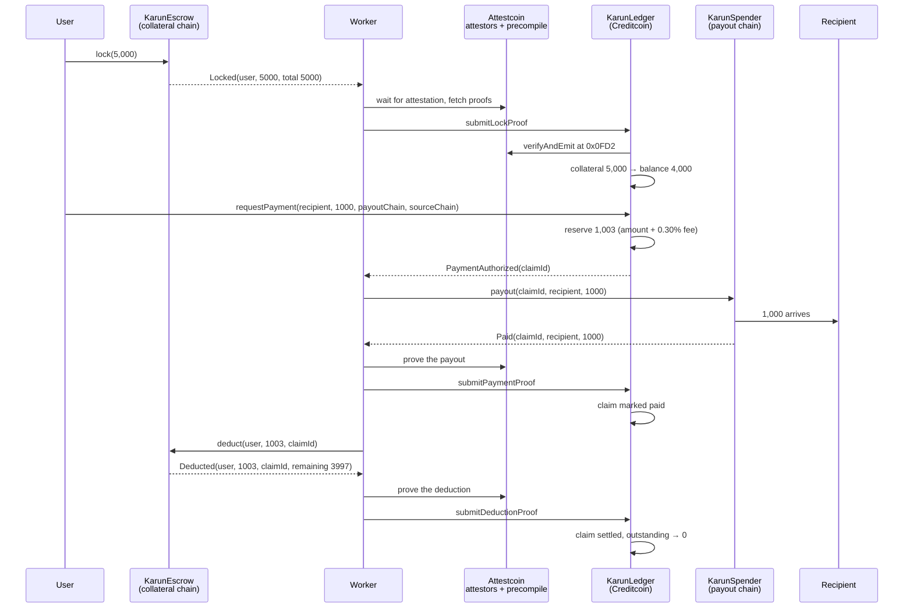

# How a payment works

The complete cycle, from locking collateral to a settled claim, with the state changes at each step.

## The cycle

## Step by step

### 1. Lock

The user calls `lock` on the escrow of a chain where they already hold stablecoins. Nothing else happens yet: no token is minted for them, no balance appears. The escrow emits `Locked` carrying the cumulative total.

### 2. Prove the lock

The worker waits until the Attestcoin attestors have attested the block containing that transaction, which takes roughly eight minutes on testnet. It then asks the proof builder service for a Merkle proof of transaction inclusion and a continuity proof linking that block to an on chain attestation, and submits both to `submitLockProof`.

The arbiter calls the Block Prover Precompile. If verification succeeds, it decodes the receipt, insists the transaction status is `0x1`, checks the event came from the registered escrow, and syncs the collateral. The spendable balance opens at the loan-to-value ratio, currently 80% for stablecoins.

> The precompile proves inclusion, not success. A reverted transaction is still included in a block. The arbiter therefore checks the receipt status itself, as the protocol documentation requires.

### 3. Authorise a payment

The user calls `requestPayment` on Creditcoin with the recipient, the amount, the chain to pay on and the chain to settle from. The arbiter checks three things: the payout chain accepts payouts, the source chain holds enough of this user's collateral, and the amount plus fee fits inside the spendable balance. It reserves the total, creates the claim, and emits `PaymentAuthorized`.

Reserving before paying is what prevents double spending. All balance accounting happens in one place, so two payments authorised in the same block cannot both draw on the same collateral.

### 4. Pay the recipient

The worker calls `payout` on the spender of the target chain. The recipient receives real stablecoins from the Karun pool. They sign nothing, hold no gas on any other chain, and do not need to know the protocol exists.

### 5. Prove the payout

The payout transaction is proven back to Creditcoin the same way the lock was. The arbiter checks that the claim id, recipient and amount all match what it authorised, then marks the claim paid. Until this proof lands, the protocol has no on chain evidence that the money actually arrived.

### 6. Deduct and prove

The worker calls `deduct` on the escrow with the claim id. The escrow moves the amount plus fee to the treasury and emits `Deducted` with the remaining lock. That transaction is proven to Creditcoin one final time. The arbiter matches the claim, releases the reservation, syncs the collateral down to the escrow's own reported figure, and closes the claim.

Outstanding debt returns to zero. The user's balance is now the loan-to-value share of whatever collateral remains.

## What the numbers look like

From the recorded testnet run:

| Stage | Collateral | Spendable | Outstanding | Recipient |
|---|---|---|---|---|
| After lock, before proof | 5,000 | 0 | 0 | 0 |
| Lock proven | 5,000 | 4,000 | 0 | 0 |
| Payment authorised | 5,000 | 2,997 | 1,003 | 0 |
| Recipient paid | 5,000 | 2,997 | 1,003 | 1,000 |
| Deduction settled | 3,997 | 3,197.60 | 0 | 1,000 |

The user spent 1,000, paid 3 in fees, and never bridged anything.

## Why the 80%

The gap between collateral and spendable balance covers the window between authorising a payment and settling it. During those minutes the protocol has paid a recipient but has not yet recovered the funds. The buffer absorbs latency, and for non stablecoin collateral it would also absorb price movement. It is a per chain parameter, so a volatile asset can carry a lower ratio without affecting stablecoin users.
